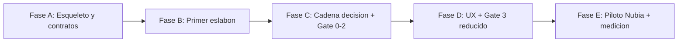

# Roadmap de Construccion del MVP

Este roadmap describe como construir el MVP-1 del SiriusLabs Venture Engine.

No son las fases 0-6 del pipeline de ventures. Son fases de build del monorepo y de la validacion manual en Cursor.

## Reglas del roadmap

- Este archivo es vivo: si el plan cambia, se actualiza aca.
- Cada fase tiene checkboxes de construccion y un bloque de QA verificable.
- Una fase no se cierra hasta que Lucía corra su QA y lo apruebe.
- El resultado de QA aprobado se registra en `development/qa/fase-X.md`.
- Cada avance relevante se registra en `development/BITACORA.md`.
- No marcar una fase como cerrada solo porque "parece lista"; debe cumplir su QA.

## Vista general

---

## Fase A — Esqueleto y contratos

**Objetivo:** dejar montada la base del monorepo para que los agentes puedan leer/escribir estado en archivos y validar handoffs sin ejecutar ningun agente todavia.

**Dependencias:** ninguna.

### Piezas a construir

- [x] Crear estructura base: `agents/`, `contracts/`, `runs/`, `scripts/`.
- [x] Crear `contracts/state.schema.json`.
- [x] Crear `contracts/handoff-v2.schema.json`.
- [x] Crear `contracts/skill-io.md` con inputs obligatorios por skill destino.
- [x] Incluir en `contracts/skill-io.md` tabla de alias plano -> canonico.
- [x] Crear `contracts/plantillas-por-fase.md` con anclas esperadas por fase.
- [x] Crear `scripts/new-project.py`.
- [x] Crear `scripts/validate-handoff.py`.
- [x] Crear `scripts/cost-report.py`.
- [x] Crear fixtures minimos para probar scripts sin correr agentes reales.
- [x] Crear o actualizar `README.md` con instrucciones de ejecucion manual.

### QA / Definition of Done

- [ ] `contracts/state.schema.json` parsea como JSON valido.
- [ ] `contracts/handoff-v2.schema.json` parsea como JSON valido.
- [ ] `scripts/new-project.py` crea un proyecto de prueba con `_seed.md` y `_state.json`.
- [ ] El `_state.json` creado por `new-project.py` valida contra `state.schema.json`.
- [ ] `scripts/validate-handoff.py` con fixture correcto devuelve PASA.
- [ ] `scripts/validate-handoff.py` con `skill_id` faltante devuelve FALLA y nombra el skill faltante.
- [ ] `scripts/validate-handoff.py` con ancla inexistente devuelve FALLA y nombra la ancla.
- [ ] `scripts/cost-report.py` suma un `_cost-log.md` de fixture y devuelve costo por fase + total.
- [ ] `contracts/skill-io.md` cubre todas las transiciones del MVP-1: 0->1, 1->2, 2->3.
- [ ] QA aprobado por Lucía y registrado en `development/qa/fase-A.md`.

---

## Fase B — Primer eslabon: Shifu + Explorador

**Objetivo:** correr kickoff + Fase 0 y producir un handoff valido hacia Cartografo sin edicion manual.

**Dependencias:** Fase A aprobada.

### Piezas a construir

- [x] Crear `agents/0-shifu/SKILL.md`.
- [x] Implementar en `0-shifu` el protocolo MVP de kickoff: leer seed, producir `plan-maestro.md`, actualizar `_state.json`.
- [x] Documentar que Shifu no tiene carpeta de fase.
- [x] Crear `agents/1-explorador/SKILL.md`.
- [x] Incluir skills 1.1 `problem-discovery` y 1.2 `population-profiling`.
- [x] Crear plantilla/anclas de `fase-0/output.md`: `#problema`, `#poblacion`, `#hair-on-fire`, `#fuentes`.
- [x] Definir handoff 0->1 hacia Cartografo con outputs requeridos.
- [x] Documentar comportamiento ante input real faltante: `INPUT_REQUEST`, status `awaiting_input`, hair-on-fire INCIERTO/NO-VALIDADO.

### QA / Definition of Done

- [ ] Con un seed de prueba, Shifu produce `runs/[project]/plan-maestro.md`.
- [ ] Shifu actualiza `_state.json` sin crear `fase-0/`.
- [ ] Explorador produce `runs/[project]/fase-0/output.md` con todas las anclas requeridas.
- [ ] Explorador produce `runs/[project]/fase-0/handoff.json` hacia Cartografo.
- [ ] `scripts/validate-handoff.py` valida el handoff 0->1 a la primera.
- [ ] Al simular falta de entrevistas primarias, Explorador no inventa validacion: crea `INPUT_REQUEST` y marca hair-on-fire INCIERTO/NO-VALIDADO.
- [ ] `_cost-log.md` registra la corrida manual de Shifu/Explorador.
- [ ] QA aprobado por Lucía y registrado en `development/qa/fase-B.md`.

---

## Fase C — Cadena de decision + Gate 0-2

**Objetivo:** completar Fase 1 y Fase 2 del MVP-1, con Analista + Arquitecto de Negocio en `fase-2/`, y cerrar con un gate 0-2 consolidado basado en tres auditorias internas.

**Dependencias:** Fase B aprobada.

### Piezas a construir

- [ ] Crear `agents/2-cartografo/SKILL.md`.
- [ ] Incluir skills 2.1 `competitive-landscape` y 2.2 `solution-research` como obligatorias.
- [ ] Crear plantilla/anclas de `fase-1/output.md`.
- [ ] Crear `agents/3-analista/SKILL.md`.
- [ ] Incluir subagentes 3.A, 3.B, 3.C y 3.D como ejecucion interna.
- [ ] Crear `agents/4-arquitecto-negocio/SKILL.md`.
- [ ] Incluir skills 4.1 `business-model-design` y 4.2 `go-to-market-strategy`.
- [ ] Hacer que Agente 4 produzca el scope de producto en `fase-2/output.md#scope-producto`.
- [ ] Definir `fase-2/output.md` consolidado: Analista completo -> Negocio -> scope de producto.
- [ ] Crear o extender `agents/10-guardian/SKILL.md`.
- [ ] Incluir skill transversal 10.0 `inter-agent-handoff-validation`.
- [ ] Incluir 10.A.1, 10.A.2 y 10.A.3 como auditorias separadas.
- [ ] Definir `fase-2/gate-audit.md` como paquete consolidado para CEO.
- [ ] Definir escritura de `gate_decisions[]` con `covers_phases: [0, 1, 2]`.

### QA / Definition of Done

- [ ] Handoff 0->1 ya aprobado sigue validando despues de agregar fase 1 y fase 2.
- [ ] Cartografo produce `fase-1/output.md` con 2.1 y 2.2 presentes.
- [ ] `scripts/validate-handoff.py` valida handoff 1->2 a la primera.
- [ ] `fase-2/output.md` incluye secciones de Analista y Negocio en orden.
- [ ] `fase-2/output.md#scope-producto` existe y es referenciable.
- [ ] `fase-2/handoff.json` hacia UX referencia `#scope-producto`.
- [ ] `fase-2/gate-audit.md` contiene 10.A.1, 10.A.2 y 10.A.3 como auditorias separadas.
- [ ] Cada auditoria mantiene criterios binarios y bloqueantes propios.
- [ ] `_state.json` puede registrar una decision con `covers_phases: [0, 1, 2]` y `audits[]`.
- [ ] Al simular un bloqueante en 10.A.3, el paquete muestra el bloqueante y no habilita GO automatico.
- [ ] `_cost-log.md` registra costos de fase 1 y fase 2.
- [ ] QA aprobado por Lucía y registrado en `development/qa/fase-C.md`.

---

## Fase D — UX + Gate 3 reducido

**Objetivo:** completar Fase 3 del MVP-1 con Arquitecto UX reducido a 5.A + 5.B, y cerrar con Gate 3 reducido.

**Dependencias:** Fase C aprobada.

### Piezas a construir

- [ ] Crear `agents/5-arquitecto-ux/SKILL.md`.
- [ ] Incluir solo subagentes 5.A y 5.B para MVP-1.
- [ ] Documentar explicitamente que 5.C, 5.D y 5.E quedan fuera de scope.
- [ ] Hacer que UX lea el scope desde `fase-2/output.md#scope-producto`.
- [ ] Crear plantilla/anclas de `fase-3/output.md`: user journeys, arquitectura de informacion, wireframes.
- [ ] Extender `agents/10-guardian/SKILL.md` con 10.B reducido.
- [ ] Definir `fase-3/gate-audit.md` para coherencia UX sin WCAG, design system ni design handoff.

### QA / Definition of Done

- [ ] `scripts/validate-handoff.py` valida handoff 2->3 a la primera.
- [ ] UX no pide `6.1` al Constructor; usa `#scope-producto` de fase 2.
- [ ] `fase-3/output.md` contiene user journeys y wireframes.
- [ ] `fase-3/output.md` no incluye alta fidelidad, accesibilidad completa ni design handoff.
- [ ] `fase-3/gate-audit.md` audita coherencia entre problema validado, poblacion, scope y wireframes.
- [ ] Gate 3 reducido no evalua WCAG ni design system.
- [ ] `_cost-log.md` registra costo de fase 3.
- [ ] QA aprobado por Lucía y registrado en `development/qa/fase-D.md`.

---

## Fase E — Run piloto Nubia 0->3 + medicion

**Objetivo:** correr Nubia de punta a punta en modo `create`, medir las tres validaciones y decidir si seguimos a MVP-2/automatizacion.

**Dependencias:** Fase D aprobada.

### Piezas a construir / ejecutar

- [ ] Crear `runs/proyecto-001-nubia/_seed.md`.
- [ ] Ejecutar Shifu sobre Nubia.
- [ ] Ejecutar Fase 0 Explorador.
- [ ] Validar handoff 0->1.
- [ ] Ejecutar Fase 1 Cartografo.
- [ ] Validar handoff 1->2.
- [ ] Ejecutar Fase 2 Analista + Negocio.
- [ ] Ejecutar Guardian 10.A y producir `fase-2/gate-audit.md`.
- [ ] Registrar firma CEO en `_state.json`.
- [ ] Ejecutar Fase 3 UX.
- [ ] Ejecutar Guardian 10.B reducido.
- [ ] Registrar firma CEO de Gate 3.
- [ ] Completar `_cost-log.md`.
- [ ] Registrar resultados de validacion en `development/qa/fase-E.md`.

### QA / Definition of Done

- [ ] Ediciones manuales de handoff por fase: <= 1.
- [ ] Handoffs que pasan `validate-handoff.py` a la primera: >= 80%.
- [ ] Cada output cumple la plantilla y criterio de calidad de su skill.
- [ ] Decision CEO del gate 0-2 con paquete del Guardian: <= 2 minutos.
- [ ] Input requests generados son autocontenidos y entendibles sin contexto extra.
- [ ] Costo total Fase 0->3 registrado en USD.
- [ ] Costo por fase identificado.
- [ ] Fase mas cara identificada.
- [ ] Decision de salida documentada: automatizacion, ClickUp, MVP-2 o iteracion del contrato.
- [ ] QA aprobado por Lucía y registrado en `development/qa/fase-E.md`.

---

## Fuera de alcance de este roadmap inmediato

- Construir Agente 6 Constructor.
- Construir agentes 7, 8 o 9.
- Montar Postgres, Inngest o ClickUp.
- Ejecutar Girasol en modo audit.
- Construir la app real de Nubia.

Girasol queda como segundo run despues de validar Nubia.
